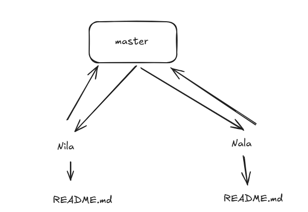

# git-learning

## Git
```sh
mkdir learn1
cd learn1
git init
vi README.md
git status
git add README.md
git status
git commit -m 'Initial commit'
```

## Git Branching
```sh
git checkout -b develop
vi myfirstscript.sh
git status
git add myfirstscript.sh
git commit -m "Initial commit in develop"
```

## Git Merge
```sh
git checkout master
git merge develop
ls -ltr
```

## Git Merge Conflict Resolve




```sh
mkdir learn2
cd learn2
git init
vi README.md
vi myfirstscript.sh
git status
git add README.md myfirstscript.sh
git status
git commit -m "Initial commit"

git checkout -b Nila
vi README.md
git status
git add README.md
git commit -m "Updated from Nila"

git checkout master

git checkout -b Nala
vi README.md
git status
git add README.md
git commit -m "Updated from Nala"

git checkout master
git merge Nila
git status
git merge Nala # At this point merge conflict will occur
git ls-files -u # This will list all merge conflict files 
vi README.md # Resolving conflict
git status
git commit -m "Resolving conflict"
git status
```